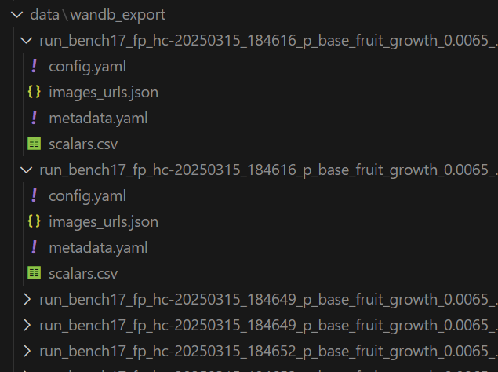

# Wandb Export

A package to export runs from a WandB project to a local folder.

<p align="center">
  
</p>

Relies on Hydra for configuration management but can still be used as a CLI tool by automatically creating a default config file.

For each run, it will export :
- the config file used for the run in a yaml file
- the metrics in a csv file
- the image URLs
- metadata such as ID or run name
- the histograms in a csv file (optional)

## Installation


```bash
pip install -r requirements.txt
pip install wandb-export
```

## Usage

First, you will need to initialize your config folder with the following command:

```bash
wandb-export-init-config
```

This will create a directory `./configs_wandb_export/` in your current working directory that the package will use as Hydra's config directory. It will include a file `config_default.yaml` that will be used by default.

Fill that config file as explained below and then you can run the following command to export the runs:

```bash
wandb-export
```

Or to use a different config file:

```bash
wandb-export --config-name=<config_name>.yaml
```

## Configuration

The configuration file is a [Hydra](https://hydra.cc/docs/intro/) config file. Fields are explained below:

```yaml
# The name of the WandB project to use.
project: user/project

# The filters that will be applied to the config for accepting a run, following WandB filters. Example:
filters: 
  "summary_metrics._step":
    "$gte": 50000
  "config.benchmark_name": bench19_fp_hc

# How many samples maximal to use for the plot.
samples: 10000

# The minimum number of metrics to have in the run to be considered.
min_n_metrics: 0

# Which data types to log.
data_types:
  scalar : True
  histogram : False
  image_url: True
  config : True
  metadata : True
```

## Python API

You can also use the package as a Python API:

```python
from wandb_export import export_wandb_data
export_wandb_data()
```

It will use the same configuration file as the CLI tool.